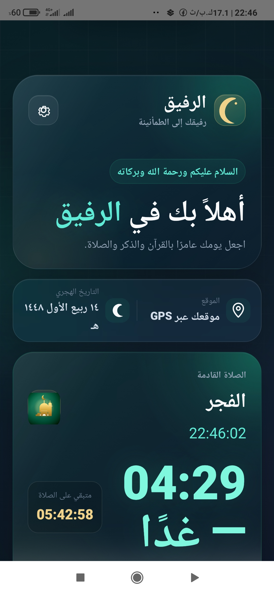
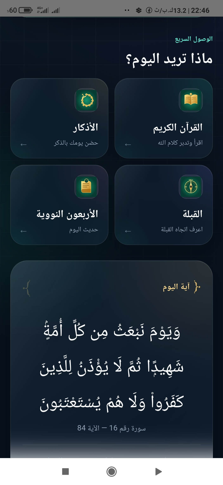
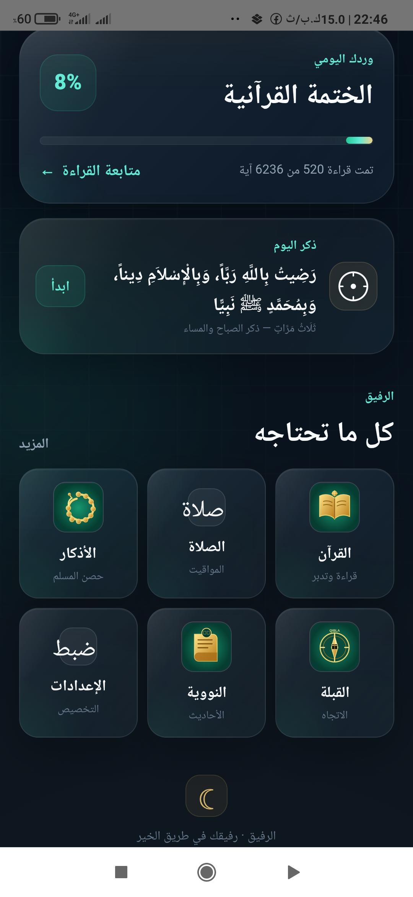

# Ar-Rafeeq 4 | الرفيق 4
> **Advanced Islamic Companion PWA & Native Android Application**

Ar-Rafeeq 4 is a high-performance, offline-first Islamic utility application engineered for reliability, accessibility, and precision. Built using a **Spec-Driven Development (SDD)** methodology, it represents a professional-grade implementation of modern web and mobile engineering.

---

## 🏗 Architecture & Engineering

The project follows a modular **Vanilla JS Architecture** to ensure maximum performance and minimal overhead, optimized for both web and native mobile environments.

| Component | Technology | Description |
| :--- | :--- | :--- |
| **Frontend** | HTML5, CSS3, Vanilla JS | Optimized for RTL (Right-to-Left) and Arabic typography. |
| **Mobile Bridge** | Capacitor | Native Android integration for background services and alarms. |
| **Offline Engine** | Service Workers (PWA) | Full offline capability with strategic App Shell caching. |
| **Data Layer** | Local JSON Bundles | 114 Surahs, Tafsir Saadi, Adhkar, and Hadith served locally. |
| **Logic Core** | Modular Prayer Engine | Real-time astronomical calculations for prayer times. |

---

## 🛠 Methodology: Spec-Driven Development (SDD)

This version of Ar-Rafeeq was developed using the **Spec Kit (specify-cli)** framework, ensuring that every feature follows a rigorous engineering lifecycle:

1.  **Constitution:** Establishing core project principles and architectural constraints.
2.  **Specification:** Defining technical requirements before implementation.
3.  **Plan & Tasks:** Breaking down complex features into verifiable atomic units.
4.  **Analyze & Implement:** Continuous validation of code against the baseline specification.
5.  **Converge:** Final verification and artifact generation.

---

## 🚀 Key Features

*   **Precise Prayer Times:** Location-aware calculations using `PrayerEngine` and `LocationManager`.
*   **Native Adhan Alerts:** Background audio notifications on Android using `AlarmManager` and native plugins.
*   **Comprehensive Content:** Full Quran (114 Surahs), Tafsir Saadi, 40 Nawawi Hadiths, and Adhkar.
*   **Interactive Qibla:** Real-time direction tracking via device sensors.
*   **Liquid Glass UI:** Modern, responsive, and aesthetic interface with full RTL support.
*   **PWA Ready:** Installable on any device with persistent offline access.

---

## 🛤 The Evolution Journey: Web → PWA → Android

Ar-Rafeeq 4 is the result of a deliberate, multi-stage engineering evolution:

1.  **Phase 1: The Web Foundation (Static Core):** Building a lightweight, high-performance Islamic portal with zero external dependencies using a modular Vanilla JS core.
2.  **Phase 2: The PWA Transition (Offline-First):** Implementing advanced Service Workers and strategic App Shell caching for 100% availability in low-connectivity areas.
3.  **Phase 3: The Android Leap (Native Integration):** Leveraging Capacitor to bridge JavaScript with native Android `AlarmManager`, ensuring reliable Adhan alerts even when the device is asleep.

---

## 📸 Visual Experience (Liquid Glass UI)

The following screenshots showcase the actual "Liquid Glass" design system implemented in Ar-Rafeeq 4, featuring modern Arabic typography and a professional glassmorphism aesthetic.

| Home Screen | Quick Access | Dashboard |
| :---: | :---: | :---: |
|  |  |  |

---

## 📥 Installation & Deployment

### Native Android (APK/AAB)
The latest stable build with fixed native Adhan alerts is available in the repository. To build from source:
1.  Run `npm install` and `npm run cap:sync`.
2.  Open the `android/` directory in Android Studio.
3.  Build the **Release AAB** for Google Play deployment.

### Web (Static Hosting)
Deploy to GitHub Pages or any static provider by serving the root directory. Ensure `sw.js` and `manifest.json` are accessible for PWA functionality.

---

## 🗺 Roadmap & Future Vision

*   **Phase 1:** Enhanced Qibla precision using advanced sensor fusion algorithms.
*   **Phase 2:** Multi-language support (English, French, Urdu) to reach a global audience.
*   **Phase 3:** Interactive Quran audio streaming and offline management.
*   **Phase 4:** Home screen widgets for instant prayer time access on Android and iOS.

---

## 🤝 Contributing Guidelines

We invite developers and thinkers to help us elevate Ar-Rafeeq 4.
*   **Fork** the repository and review the **Constitution** in `.specify/memory/`.
*   Focus on **Performance Optimization** and **Localization**.
*   Submit a **Pull Request** with a clear description of your engineering choices.

---

## 📬 Contact & Collaboration

Developed and maintained by **Gophisb**. We welcome technical inquiries and contributions.

*   **Lead Developer:** Gophisb
*   **Email:** [faraspmp@gmail.com](mailto:faraspmp@gmail.com)
*   **Engineering Partner:** Manus AI

---

## 📜 License

This project is licensed under the **MIT License** - see the [LICENSE](LICENSE) file for details.

---

> "Precision in engineering, devotion in purpose. Built for the community, by the community."
